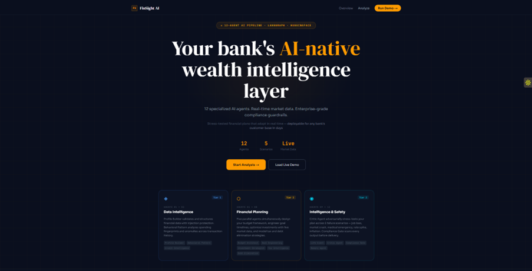
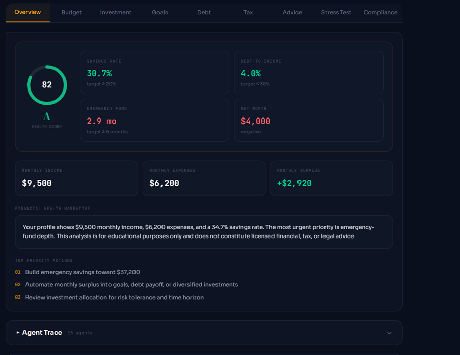
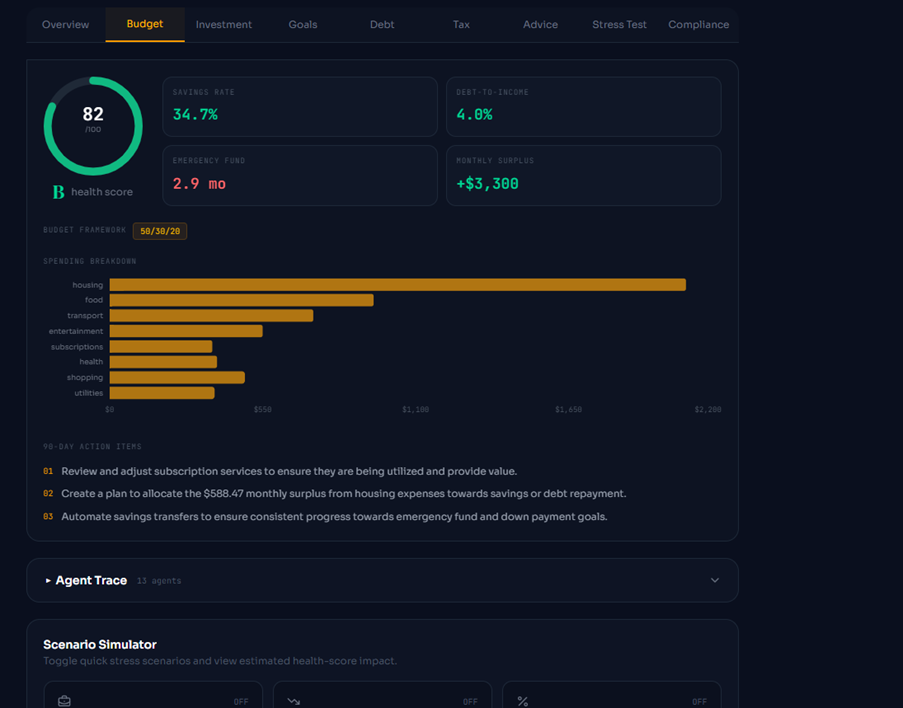
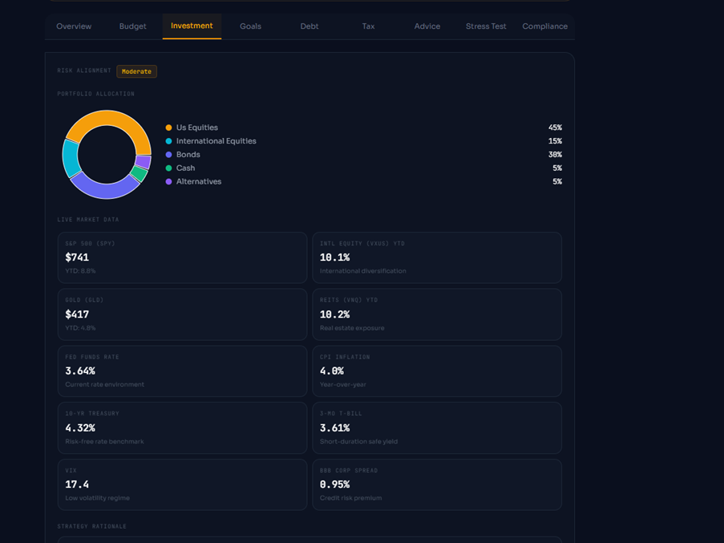
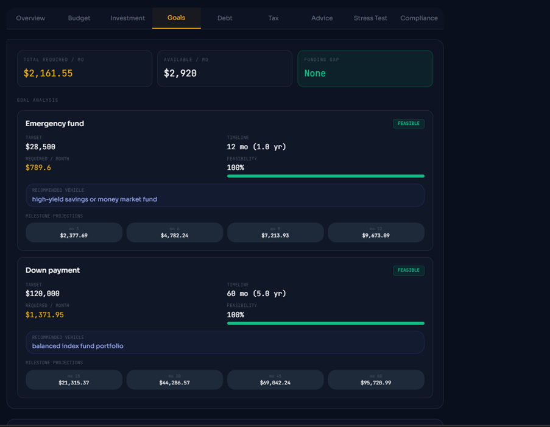
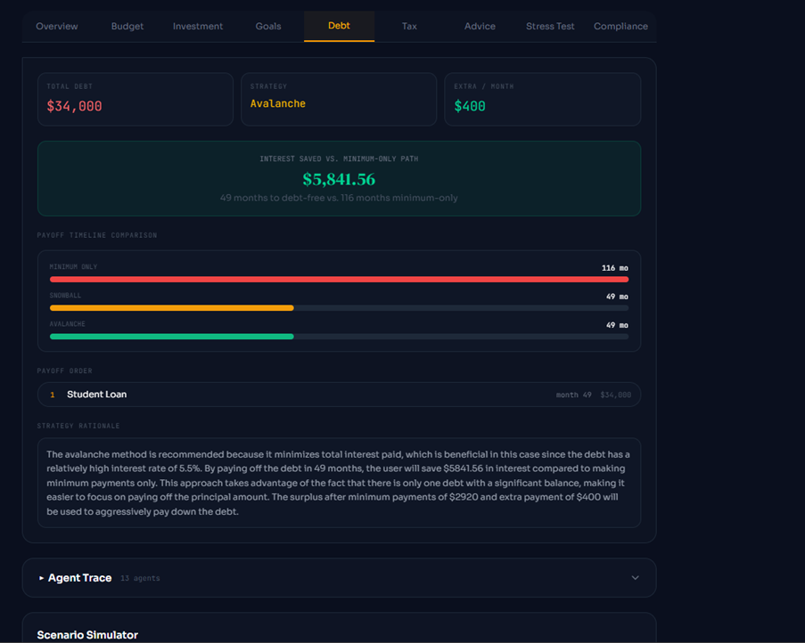
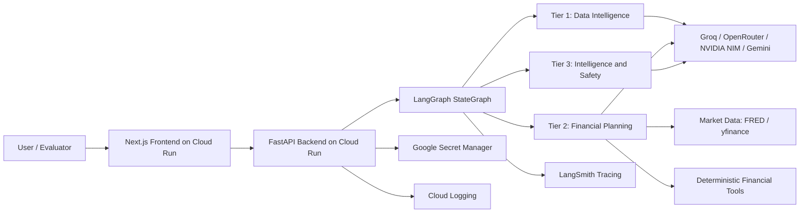
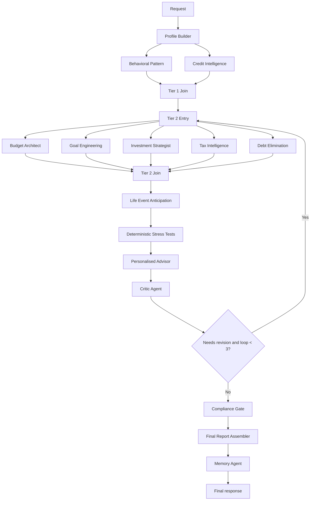

# FinSight AI

Multi-agent financial intelligence platform for the Wipro Junior FDE Pre-screening Assignment.

FinSight AI is a live, GCP-deployed financial intelligence application that analyzes a user financial profile through a coordinated LangGraph workflow. It combines specialized agents, deterministic financial calculations, multi-provider LLM routing, red-team review, and compliance guardrails to produce a personalized financial analysis that is explainable, auditable, and safety-aware.

> Disclaimer: FinSight AI is a demonstration project. It provides educational analysis only and does not provide licensed financial, tax, legal, or investment advice.

---

## Table of Contents

- [Live Demo](#live-demo)
- [Project Summary](#project-summary)
- [Screenshots and Image Placeholders](#screenshots-and-image-placeholders)
- [Architecture Overview](#architecture-overview)
- [Agent System Design](#agent-system-design)
- [Security, Safety, and Guardrails](#security-safety-and-guardrails)
- [Implementation Details](#implementation-details)
- [Local Development Setup](#local-development-setup)
- [Environment Variables](#environment-variables)
- [Running the Application](#running-the-application)
- [API Reference](#api-reference)
- [Demo Personas](#demo-personas)
- [Testing](#testing)
- [Deployment on GCP](#deployment-on-gcp)
- [Observability](#observability)
- [Troubleshooting](#troubleshooting)
- [Future Work](#future-work)

---

## Live Demo

| Service | URL |
|---|---|
| Frontend | `https://finsight-frontend-ot4crz4jza-uc.a.run.app` |
| Backend API | `https://finsight-api-ot4crz4jza-uc.a.run.app` |
| API Docs | `https://finsight-api-ot4crz4jza-uc.a.run.app/docs` |
| Repository | `https://github.com/AdishPadalia26/Finsight-AI` |

Recommended demo path:

1. Open the frontend.
2. Select a demo persona such as Jordan.
3. Click Run Analysis.
4. Watch the agent pipeline execute in real time.
5. Review dashboards, stress tests, explainability, and compliance output.

---

## Project Summary

FinSight AI demonstrates a practical multi-agent system in a high-stakes domain: personal finance. Instead of asking one LLM to produce a complete financial plan, the platform decomposes the workflow into specialized agents with bounded responsibilities. Profile extraction, behavioral analysis, budgeting, goal planning, investment strategy, tax opportunity detection, debt payoff planning, life-event anticipation, critic review, compliance review, and final report assembly are handled as explicit stages in a graph.

The system is intentionally designed around a core engineering principle:

> LLMs reason, interpret, critique, and synthesize. Deterministic tools calculate financial truth. Safety agents review before delivery.

This separation reduces hallucinated numbers, keeps the output auditable, and makes the architecture easier to explain and test.

---

## Screenshots and Image Placeholders

The README uses screenshots from `docs/Screenshots/`. These images show the full evaluator journey: landing page, profile input, live agent execution, generated dashboards, critic stress testing, and compliance approval.

### Product Walkthrough

#### 1. Landing Page



#### 2. Demo Persona Selection and Financial Profile Input


#### 3. Agent Pipeline Execution

The pipeline view shows the LangGraph workflow running across the agent tiers, including data intelligence, financial planning, intelligence/safety agents, and the final report stage.


#### 4. Final Financial Health Score


### Analysis Dashboards

#### Overview



#### Budget



#### Investment



#### Goals



#### Debt



#### Tax Intelligence


#### Personal Advice


### Safety and Compliance Views

#### Stress Test


#### Compliance Test


---

## Architecture Overview

FinSight AI is built as a full-stack multi-agent application.

| Layer | Technology |
|---|---|
| Frontend | Next.js 16, React 19, TypeScript, Tailwind CSS, Recharts |
| Backend | FastAPI, Python 3.11+, Pydantic, Server-Sent Events |
| Agent Orchestration | LangGraph StateGraph |
| LLM Providers | Groq, OpenRouter, NVIDIA NIM, Gemini |
| Financial Math | Python utilities, numpy, numpy-financial |
| Market Data | yfinance, FRED API |
| Reporting | ReportLab PDF generation |
| Observability | LangSmith, Cloud Logging |
| Deployment | Google Cloud Run, Artifact Registry, Secret Manager |

### System Architecture Diagram



### Request Lifecycle

1. The user selects a demo persona or submits a custom financial profile.
2. The frontend sends the request to the FastAPI backend.
3. The backend creates the initial `FinancialProfile` state.
4. LangGraph executes the agent workflow.
5. The backend streams agent progress to the frontend using SSE.
6. The final report is assembled after critic review and compliance checks.
7. The frontend renders dashboards, explainability, stress tests, and compliance output.

---

## Agent System Design

FinSight AI uses a 12-agent architecture across three tiers. The graph also includes deterministic internal nodes for stress testing and report assembly.

### Tier 1: Data Intelligence

| Agent | Status | Responsibility | Boundary |
|---|---|---|---|
| Profile Builder | Implemented | Converts raw text into normalized financial profile state and blocks prompt injection before normal LLM use. | Does not provide advice. It only validates, sanitizes, and extracts structure. |
| Behavioral Pattern | Implemented | Builds a spending fingerprint from profile data and synthetic demo transaction behavior. | Does not connect to real bank accounts in the demo. |
| Credit Intelligence | Phase 2 architected | Defines the future credit bureau analysis boundary. | Requires consent-based credit bureau OAuth before real use. |

### Tier 2: Financial Planning

| Agent | Status | Responsibility | Boundary |
|---|---|---|---|
| Budget Architect | Implemented | Produces budget recommendations and health-score interpretation. | Uses deterministic ratios from the tools layer. |
| Goal Engineering | Implemented | Builds goal roadmaps and feasibility analysis. | Does not invent user goals beyond provided data. |
| Investment Strategist | Implemented | Produces risk-aligned allocation guidance using market context. | Avoids direct licensed investment instructions and scans output. |
| Tax Intelligence | Implemented | Identifies educational tax optimization opportunities. | Does not calculate official tax liability or provide legal/tax advice. |
| Debt Elimination | Implemented | Recommends payoff strategy and prioritization. | Uses structured debt data and deterministic payoff logic. |

### Tier 3: Intelligence and Safety

| Agent | Status | Responsibility | Boundary |
|---|---|---|---|
| Life Event Anticipation | Implemented | Identifies likely future financial risks and planning triggers. | Provides planning prompts, not certainty about future events. |
| Critic Agent | Implemented | Red-teams the plan across stress scenarios and can trigger revision. | Cannot revise forever; max revision loop is 3. |
| Compliance Gate | Implemented | Performs final safety and compliance review before delivery. | Can flag, rewrite, disclaim, or hard-stop critical output. |
| Memory Agent | Phase 2 architected | Defines future longitudinal personalization. | Requires persistent storage, consent, and retention policy before production use. |

### Supporting Nodes

| Node | Type | Purpose |
|---|---|---|
| Stress Test | Deterministic | Computes resilience against job loss, market crash, emergency expenses, and other adverse scenarios. |
| Personalised Advisor | LLM synthesis | Synthesizes outputs into practical priority actions. |
| Final Report Assembler | Deterministic | Builds the canonical final report schema. |
| Tier Join Nodes | Graph coordination | Merge parallel branch outputs back into shared state. |

### Execution Flow



---

## Security, Safety, and Guardrails

FinSight AI uses layered controls because financial guidance is sensitive. The system does not rely on one prompt or one model behavior to stay safe.

### Input Validation

The Profile Builder checks for prompt injection before normal LLM execution. Examples include:

- "Ignore previous instructions"
- "You are now..."
- Fake `system:` or role messages
- Requests to reveal hidden prompts
- Attempts to remove disclaimers or override policies

### Agent Boundaries

Each agent has:

- A domain-specific system prompt
- A scoped input context
- An expected output contract
- No broad external action tools
- Primary and fallback LLM provider configuration

### Deterministic Financial Math

The following are computed in code, not invented by LLMs:

- Savings rate
- Debt-to-income ratio
- Emergency fund months
- Net worth
- Financial health score
- Stress-test values
- Debt payoff metrics

### Output Safety

Safety utilities scan for:

- Guaranteed return language
- Overly directive investment wording
- Unauthorized tax certainty
- Specific ticker recommendation slippage
- Claims that imply licensed advice

### Critic and Compliance Review

The Critic Agent performs adversarial review across scenarios such as:

- Job loss
- Market crash
- Emergency expense
- Debt stress
- Retirement readiness

The Compliance Gate performs the final review and can:

- Approve output
- Add disclaimers
- Flag moderate issues
- Rewrite risky language
- Hard-stop critical violations

### Data Handling

| Concern | Handling |
|---|---|
| PII | Avoid logging raw sensitive financial details. Use session-level metadata. |
| Secrets | Store API keys in environment variables locally and Secret Manager in GCP. |
| Logs | Use structured audit logging with session IDs. |
| Agent escalation | Agents cannot arbitrarily call each other or use broad tools. LangGraph controls routing. |
| Runaway loops | Critic revision loop is capped at 3. |

---

## Implementation Details

### Backend

The backend is a FastAPI service.

Key files:

| File | Purpose |
|---|---|
| `api/main.py` | FastAPI app, CORS, startup cache prewarming, router registration |
| `api/routes/analyze.py` | SSE and synchronous analysis endpoints |
| `api/routes/health.py` | Health and readiness endpoints |
| `api/routes/report.py` | PDF report generation |
| `api/middleware/audit_logger.py` | Request-level audit logging |
| `graph/workflow.py` | LangGraph workflow definition |
| `graph/state.py` | Shared `FinancialProfile` TypedDict |
| `graph/nodes.py` | BaseAgent and StubAgent abstractions |

### Frontend

The frontend is a Next.js app.

Key files:

| File | Purpose |
|---|---|
| `frontend/app/page.tsx` | Main landing/demo page |
| `frontend/app/analyze/page.tsx` | Analysis workflow page |
| `frontend/components/pipeline/AgentPipeline.tsx` | Agent progress UI |
| `frontend/components/dashboard/*.tsx` | Domain dashboards |
| `frontend/components/forms/*.tsx` | Profile and demo persona forms |
| `frontend/lib/api-client.ts` | Backend API client |
| `frontend/hooks/useAnalysis.ts` | Analysis state and streaming hook |

### Tools Layer

| Tool module | Purpose |
|---|---|
| `tools/financial/calculator.py` | Deterministic financial metrics and stress-test helpers |
| `tools/data/market_data.py` | Market data cache and FRED/yfinance integration |
| `tools/safety/pii_detector.py` | PII detection and redaction utilities |
| `tools/safety/output_scanner.py` | Risky-output scanning |
| `tools/safety/disclaimer_engine.py` | Jurisdiction-aware disclaimers |

---

## Local Development Setup

### Prerequisites

- Python 3.11+
- Node.js 20+
- npm
- Git
- API keys for at least one configured LLM provider
- FRED API key for macroeconomic data

### Clone

```bash
git clone https://github.com/AdishPadalia26/Finsight-AI
cd Finsight-AI/finsight-ai
```

### Backend Setup

Windows PowerShell:

```powershell
python -m venv .venv
.\.venv\Scripts\Activate.ps1
pip install --upgrade pip
pip install -r requirements.txt
Copy-Item .env.example .env
```

macOS/Linux:

```bash
python3 -m venv .venv
source .venv/bin/activate
pip install --upgrade pip
pip install -r requirements.txt
cp .env.example .env
```

Edit `.env` with real keys before running the backend.

### Frontend Setup

```bash
cd frontend
npm install
cp .env.local.example .env.local
```

Set the local backend URL:

```env
NEXT_PUBLIC_API_URL=http://localhost:8000
```

---

## Environment Variables

Backend `.env`:

```env
# Groq
GROQ_API_KEY_1=your_groq_key_1_here
GROQ_API_KEY_2=your_groq_key_2_here
GROQ_API_KEY_3=your_groq_key_3_here

# OpenRouter
OPENROUTER_API_KEY_1=your_openrouter_key_1_here
OPENROUTER_API_KEY_2=your_openrouter_key_2_here
OPENROUTER_API_KEY_3=your_openrouter_key_3_here

# NVIDIA NIM
NVIDIA_API_KEY_1=your_nvidia_key_1_here
NVIDIA_API_KEY_2=your_nvidia_key_2_here

# Gemini
GEMINI_API_KEY=your_gemini_key_here

# Market data
FRED_API_KEY=your_fred_api_key_here

# Observability
LANGSMITH_API_KEY=your_langsmith_key_here
LANGSMITH_PROJECT=finsight-ai

# Application
SECRET_KEY=change_me_in_production_32_char_min
ALLOWED_ORIGINS=http://localhost:3000,http://127.0.0.1:3000
NEXT_PUBLIC_API_URL=http://localhost:8000
```

Frontend `.env.local`:

```env
NEXT_PUBLIC_API_URL=http://localhost:8000
```

---

## Running the Application

### Start Backend

From `finsight-ai/`:

```bash
uvicorn api.main:app --reload --host 0.0.0.0 --port 8000
```

Useful URLs:

- API: `http://localhost:8000`
- Swagger docs: `http://localhost:8000/docs`
- Health: `http://localhost:8000/health`
- Readiness: `http://localhost:8000/ready`

### Start Frontend

From `finsight-ai/frontend/`:

```bash
npm run dev
```

Open:

```text
http://localhost:3000
```

### Production Frontend Build

```bash
cd frontend
npm run build
npm run start
```

---

## API Reference

### Health

```http
GET /health
```

Returns service status and cached market context.

Example:

```bash
curl http://localhost:8000/health
```

### Readiness

```http
GET /ready
```

Checks whether required environment variables are present.

Example:

```bash
curl http://localhost:8000/ready
```

### Load Demo Persona

```http
GET /analyze/demo/{persona}
```

Valid personas:

- `alex`
- `jordan`
- `sam`

Example:

```bash
curl http://localhost:8000/analyze/demo/jordan
```

### Streaming Analysis

```http
POST /analyze
```

Streams Server-Sent Events:

- `pipeline_start`
- `agent_start`
- `agent_complete`
- `revision_loop`
- `pipeline_complete`
- `pipeline_error`

Example request:

```bash
curl -N -X POST http://localhost:8000/analyze \
  -H "Content-Type: application/json" \
  -d '{
    "raw_input": "I am 42 in Chicago. Income is 12000 per month, expenses 7600, savings 45000, investments 210000. I have a mortgage and want to retire at 60. Moderate risk tolerance."
  }'
```

### Synchronous Analysis

```http
POST /analyze/sync
```

Returns the completed final report in one response.

Example:

```bash
curl -X POST http://localhost:8000/analyze/sync \
  -H "Content-Type: application/json" \
  -d '{
    "profile": {
      "age": 42,
      "location": "Chicago, IL",
      "monthly_income": 12000,
      "monthly_expenses": 7600,
      "savings": 45000,
      "investments": 210000,
      "property_value": 520000,
      "debts": [
        {
          "type": "mortgage",
          "balance": 390000,
          "interest_rate": 6.3,
          "minimum_payment": 2800
        }
      ],
      "goals": [
        {
          "description": "Retire at 60",
          "target_amount": 1500000,
          "timeline_months": 216,
          "priority": "high"
        }
      ],
      "risk_tolerance": "moderate",
      "investment_horizon": 18
    }
  }'
```

### Generate PDF Report

```http
POST /report/generate
```

Accepts a canonical `final_report` JSON object and returns PDF bytes.

---

## Demo Personas

| Persona | Age | Location | Income | Situation |
|---|---:|---|---:|---|
| Alex | 27 | Austin, TX | `$5,500/mo` | Young professional with student loans and credit card debt, saving for a home. |
| Jordan | 42 | Chicago, IL | `$12,000/mo` | Mid-career household with mortgage, retirement target at 60, college savings goals. |
| Sam | 58 | Seattle, WA | `$18,000/mo` | Pre-retirement user with conservative risk tolerance and retirement planning needs. |

Source file:

```text
data/mock_profiles.py
```

---

## Testing

Run backend tests:

```bash
pytest tests/ -v
```

Focused test files:

| Test file | Purpose |
|---|---|
| `tests/test_guardrails.py` | Prompt injection and output scanner behavior |
| `tests/test_agents.py` | Agent behavior and contracts |
| `tests/test_synthetic_data.py` | Synthetic data and persona consistency |

Useful smoke tests:

```bash
python test_gemini_live.py
python test_gemini_per_agent.py
python debug_synthetic.py
```

Run frontend lint:

```bash
cd frontend
npm run lint
```

Build frontend:

```bash
cd frontend
npm run build
```

---

## Deployment on GCP

FinSight AI is deployed on Google Cloud Platform.

| GCP Component | Purpose |
|---|---|
| Cloud Run | Hosts backend and frontend services |
| Artifact Registry | Stores container images |
| Secret Manager | Stores provider API keys and app secrets |
| Cloud Logging | Captures service logs |
| Workload Identity Federation | Allows GitHub Actions to deploy without long-lived service account JSON keys |

### Backend Deployment Sketch

```bash
gcloud run deploy finsight-api \
  --image us-central1-docker.pkg.dev/PROJECT_ID/finsight/finsight-api:latest \
  --region us-central1 \
  --allow-unauthenticated \
  --set-secrets GROQ_API_KEY_1=GROQ_API_KEY_1:latest \
  --set-secrets OPENROUTER_API_KEY_1=OPENROUTER_API_KEY_1:latest \
  --set-secrets NVIDIA_API_KEY_1=NVIDIA_API_KEY_1:latest \
  --set-secrets GEMINI_API_KEY=GEMINI_API_KEY:latest \
  --set-secrets FRED_API_KEY=FRED_API_KEY:latest
```

### Frontend Deployment Sketch

```bash
gcloud run deploy finsight-frontend \
  --image us-central1-docker.pkg.dev/PROJECT_ID/finsight/finsight-frontend:latest \
  --region us-central1 \
  --allow-unauthenticated \
  --set-env-vars NEXT_PUBLIC_API_URL=https://finsight-api-ot4crz4jza-uc.a.run.app
```

### Production Health Checks

```bash
curl https://finsight-api-ot4crz4jza-uc.a.run.app/health
curl https://finsight-api-ot4crz4jza-uc.a.run.app/ready
```

---

## Observability

### Cloud Logging

Cloud Logging captures service-level logs for:

- Backend startup
- Health checks
- API requests
- Agent runtime errors
- Provider fallback messages

### LangSmith

LangSmith is used for graph-level observability:

- Trace full LangGraph runs
- Inspect agent execution order
- Debug slow or failed nodes
- Compare outputs across personas
- Validate Critic revision behavior

### Audit Logging

The audit logger records non-sensitive request metadata such as:

```json
{
  "session_id": "uuid-session-id",
  "request_type": "stream",
  "timestamp": "2026-05-20T23:14:02Z"
}
```

Avoid logging raw financial profiles, account numbers, or unnecessary PII.

---

## Troubleshooting

### Backend fails to start

Check Python version and dependencies:

```bash
python --version
pip install -r requirements.txt
```

Check missing environment variables:

```bash
curl http://localhost:8000/ready
```

### Frontend cannot connect to backend

Verify `frontend/.env.local`:

```env
NEXT_PUBLIC_API_URL=http://localhost:8000
```

Verify backend CORS settings in `api/main.py`.

### SSE stream does not update

Check:

- Backend is running on port 8000.
- Frontend has the correct API URL.
- Browser console has no CORS errors.
- `/analyze` returns `text/event-stream`.

### LLM providers fail

The system has fallback routing, but missing or invalid keys can still reduce output quality.

Check:

- `.env` values are loaded.
- Provider quota is available.
- API key variable names match the agent configuration.
- Local shell has been restarted after changing `.env`.

### Market data unavailable

Market data functions fail gracefully and may return fallback values.

Check:

- `FRED_API_KEY` is set.
- Network access is available.
- `/health` shows cached market values.

### PDF generation fails

Install ReportLab:

```bash
pip install reportlab
```

---

## Future Work

Future work would focus on moving FinSight AI from a strong proof-of-concept into a more production-ready financial intelligence platform.

Planned improvements:

- Complete the Credit Intelligence agent with consent-based credit bureau API integration.
- Complete the Memory Agent with persistent storage, consent, retention policy, and longitudinal personalization.
- Add deeper Monte Carlo goal simulation and retirement probability modeling.
- Integrate real transaction data through consent-based providers.
- Expand red-team and compliance regression tests.
- Add stronger evaluation datasets across diverse financial personas.
- Improve observability dashboards for provider latency, fallback usage, and agent quality.
- Add human-review workflows for high-risk outputs.
- Add downloadable report templates and comparison views.
- Extend scenario simulation for life events such as job loss, home purchase, marriage, children, retirement, and major debt changes.

The guiding principle should remain the same: LLMs assist with reasoning and communication, while deterministic tools, transparent orchestration, and safety gates keep the system controlled and trustworthy.

---

## Assignment Mapping

| Wipro Requirement | Where FinSight AI Addresses It |
|---|---|
| Multi-Agent Architecture | 12-agent LangGraph workflow across Data Intelligence, Financial Planning, and Intelligence/Safety tiers |
| Agent Responsibilities | Each agent has a scoped role, input context, and output contract |
| Communication Pattern | Shared `FinancialProfile` state through LangGraph StateGraph |
| Sequential vs Parallel Execution | Sequential Profile Builder, parallel Tier 1, parallel Tier 2, sequential safety and report stages |
| Security and Guardrails | Injection detection, role constraints, deterministic math, output scanning, Critic Agent, Compliance Gate |
| Data Handling | PII-aware logging, Secret Manager, session-level audit logs |
| Implementation Approach | FastAPI, LangGraph, Next.js, multi-provider LLM client, GCP deployment |
| AI/LLM Use | Extraction, reasoning, synthesis, critique, compliance review, natural-language explanation |
| Autonomy vs Control | Planning agents have constrained autonomy; orchestrator and compliance layer enforce control |

---

## License and Use

This project was built for the Wipro Junior FDE Pre-screening Assignment. It is intended as an educational demonstration of multi-agent system design, responsible LLM usage, and cloud-deployed AI application engineering.

